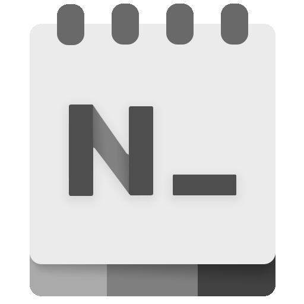

  

<h1 align="center">
  Noto
</h1>

  A modern, dark, lightweight text editor with a minimalist design.

## Tools
<b>Flutter || Dart || Local database </b>
<b>State Management:</b> Cubit  
<b>Local database:</b> Hive Package  
<b>Packages:</b> flutter_bloc, hive, hive_flutter, intl, modal_progress_hud_nsn, build_runner, hive_generator. 
<b>Fonts:</b> Poppins.

## Screenshots

&emsp; &emsp;&emsp; &emsp; &emsp; &emsp;&emsp; &emsp;

## Finally
A few resources to get you started your first Flutter project:

- [Lab: Write your first Flutter app](https://docs.flutter.dev/get-started/codelab)
- [Cookbook: Useful Flutter samples](https://docs.flutter.dev/cookbook)

For help getting started with Flutter development, view the
[online documentation](https://docs.flutter.dev/), which offers tutorials,
samples, guidance on mobile development, and a full API reference.
